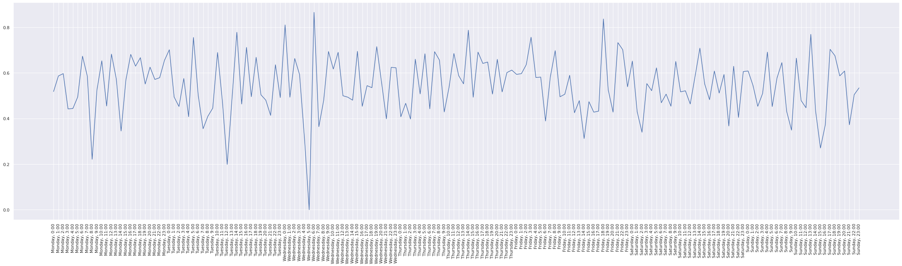

# Radio-scraper

### Table of contents
- [Function](#Function)
- [Exporter](#Exporter)
- [Vizualisation](#Vizualisation)
- [Takeaways](#Takeaways)

### Function
The files in the `function` directory are responsible for scraping the data from the api. They were deployed to a GCP cloud function, which is scheduled to run every 3 minutes. It saves the data to a Firestore database.

### Exporter
This script is responsible for fetching the data from the firestore api and exporting them to a `.csv` file for further analysis. This `.csv` is then read again by `wrangler.py` and the song and artist name are added seperately in a new column. Then `spotify.py` takes that csv and gets song features like `danceability` or `energy` from the spotify api and saves them to another `.csv`

### **Data**

### OE3

OE3 is a mix of both classics and the current charts as they cater to a general audience, irrespective of age.

| Most Played Artists on OE3      	| Number of times played 	|
|------------	|----	|
| Falco        	| 29 	|
| EAV        	| 27 	|
| Katy Perry 	| 24 	|
| Bon Jovi   	| 24 	|
| Green Day  	| 23 	|

| Most Played songs on OE3        	| Number of times played 	|
|---------------------------------	|------------------------	|
| Ostbahn                         	| 12                     	|
| Anna                            	| 12                     	|
| Schrei nach Liebe               	| 8                      	|
| Wetter, Nachrichten und Verkehr 	| 8                      	|
| Livestream                      	| 8                      	|

### RadioWien

RadioWien seems to be geared more towards older people.

| Most Played Artists on RadioWien      	| Number of times played 	|
|------------	 |----	|
| Beatles        | 61 	|
| Queen        	 | 55 	|
| Billy Joel 	 | 51 	|
| Rolling Stones | 50 	|
| Eros Ramazzotti| 47 	|

| Most Played songs on RadioWien 	| Number of times played 	|
|--------------------------------	|------------------------	|
| Upside Down                    	| 12                     	|
| In Your Eyes                   	| 11                     	|
| The Power Of Love              	| 8                      	|
| Heroes                         	| 8                      	|

### KroneHit

KroneHit's target audience is younger people. They also play the top songs less often than the other radio stations.

| Most Played Artists on KroneHit      	| Number of times played 	|
|------------	|----	|
| Ed Sheeran    | 18 	|
| Rihanna       | 17 	|
| Avici 		| 14 	|
| Katy Perry   	| 13 	|
| David Guetta  | 13 	|

| Most Played songs on RadioWien 	| Number of times played 	|
|--------------------------------	|------------------------	|
| Paradise                       	| 6                      	|
| World keeps turning            	| 4                      	|
| Faded                          	| 4                      	|
| In my mind                     	| 4                      	|
| mood (feat. iann dior)         	| 4                      	|

### Vizualisation
The visualisation was done using seaborn, matplotlib and pandas.

I plotted the different features (`acousticness`, `energy`, `liveness`, `loudness`, `speechiness`, `tempo`, `valence`) spotify assigns to their songs. The x-axis is a week, with a resolution of one hour.

#### Acousticness:

#### Energy:

#### Liveness:

#### Loudness:

#### Speechiness:

#### Tempo:

#### Valence:

### Takeaways
The correlations between song `energy`, `tempo`, etc... from the spotify features API and the time when the songs were played is very low, and I could not distinguish any pattern. I expected to be able to see that the songs got faster towards the weekend for example. This was absolutely not the case.

More interesting conclusions could be made about the target audience of a radio station by analysing the most played artists and songs. `radiowien` is geared more towards older people while `kronehit` plays only modern artists and songs. `oe3` is an interesting mix which I can only attribute to them having days where they play older and days where they play newer songs (`funky friday` would be on such a day).
